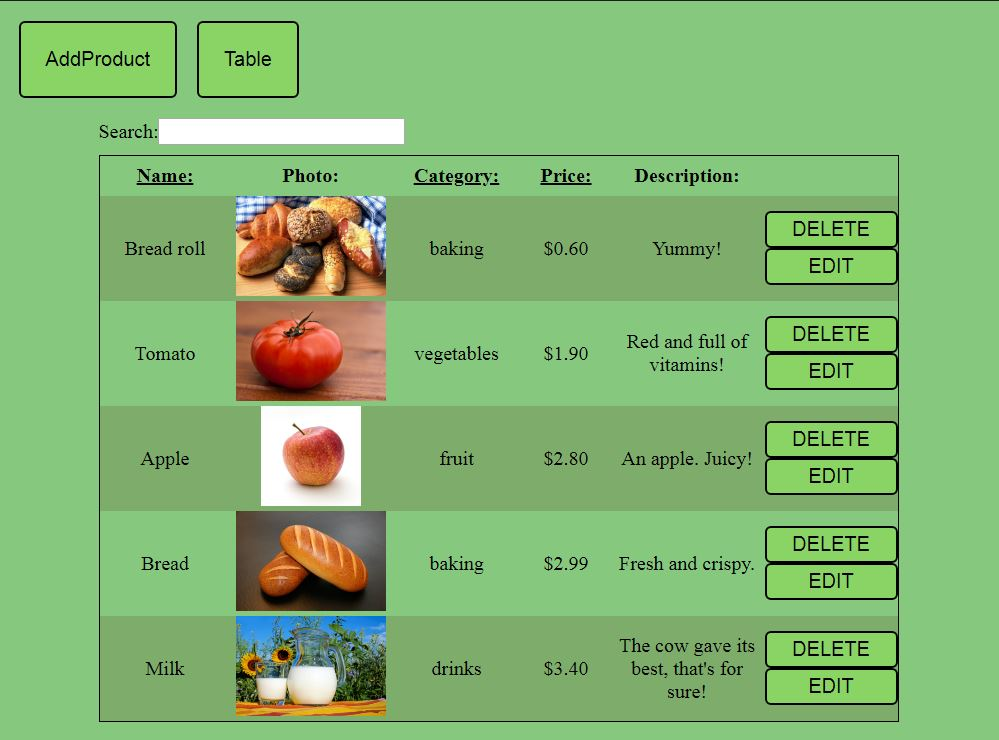

# Products list
> React application

### [LIVE PREVIEW](https://emzawadzki.github.io/ProductsList/dist/)

## Used technologies
> 

## Features
> * Adding products to list (from another tab)
> * Editing added products
> * Removing products from list
> * Products sorting
>     * by name
>     * by price
>     * by categories

## Preview

